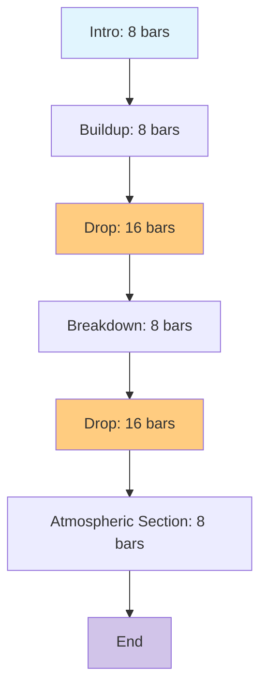

# Drum and Bass (DnB) Song Generation Plan

## Overview
This plan outlines the generation of a separated-parts DnB song using the existing midimaster project structure. The focus is on creating an energetic, layered DnB track with characteristic breakbeats, sub-bass, and atmospheric elements.

## Song Structure
The song follows a classic DnB structure with 64 total bars, emphasizing the build-drop pattern that defines the genre:

- **Intro** (Bars 1-8): Atmospheric buildup, sparse elements
- **Buildup** (Bars 9-16): Increasing intensity, layering elements
- **Drop** (Bars 17-32): Main energetic section with full DnB power
- **Breakdown** (Bars 33-40): Reduction in intensity, atmospheric focus
- **Drop** (Bars 41-56): Second main section with variations
- **Atmospheric Section** (Bars 57-64): Outro with fading elements

## Tempo, Key, and Scale
- **Tempo**: 165 BPM (within the classic 160-170 BPM range for DnB)
- **Key**: A minor
- **Scale**: A natural minor

**Rationale**: The mid-range tempo provides the driving feel essential to DnB without being overly fast or slow. A minor key delivers the energetic yet atmospheric tonality that characterizes much of the genre, allowing for modal interchange and emotive chord progressions.

## Parts Specification

### Rhythm (Channel 9)
- **Generation**: Uses RhythmGenerator with DnB rules
- **Patterns**: Amen break pattern with high syncopation (0.8 level)
- **Characteristics**: Fast breakbeats, syncopated snares, double kick fills
- **Role**: Provides the foundational groove and energy

### Bass (Channel 2)
- **Generation**: Uses BassGenerator with chord root following
- **Type**: Sub-bass with Reese bass elements
- **Patterns**: Wobble bass and rolling bass from DnBRules
- **Characteristics**: Low-frequency, driving groove that locks with rhythm
- **Role**: Creates the powerful low-end that defines DnB

### Melody (Channel 0)
- **Generation**: Uses MelodyGenerator with scale-based pitch selection
- **Type**: Atmospheric and minimal lead lines
- **Patterns**: Syncopated lead and rolling melody patterns
- **Characteristics**: Sparse, emotive lines using A minor scale notes
- **Role**: Adds emotional depth and counterpoint to the rhythm

### Harmony (Channel 1)
- **Generation**: Uses HarmonyGenerator with Roman numeral progressions
- **Type**: Pad chords and atmospheric harmonies
- **Progressions**: Simple repetitive patterns like ['i', 'iv', 'v'] and ['i', 'bVII', 'bVI', 'bVII']
- **Characteristics**: Modal chords, sustained pads for texture
- **Role**: Provides harmonic foundation and atmospheric backdrop

## Density Approach
- **Overall**: Dense density with balanced elements for energetic DnB feel
- **Rationale**: DnB's layered sound requires density to create the characteristic wall of sound, but balance prevents muddiness
- **Implementation**: Use DensityManager with dense preset for main sections, balanced for transitions
- **Syncopation**: High level (0.8) for rhythmic complexity

## Output Process
1. Generate combined MIDI using PatternOrchestrator with DnB rules
2. Create SongSkeleton with 64 bars in A minor at 165 BPM
3. Generate patterns for each part using respective generators
4. Output combined MIDI file using MidiOutput
5. Split into separate parts using midi_splitter.py:
   ```bash
   python midi_splitter.py combined_dnb.mid ./dnb_parts/
   ```
6. Result: Separate MIDI files for rhythm, bass, melody, and harmony

## Genre Rationale
DnB is characterized by fast tempos (160-180 BPM) with intricate breakbeat rhythms, heavy sub-bass, and atmospheric synths. The genre emerged from UK rave culture in the early 1990s, combining elements of jungle, reggae, and electronic music. Key characteristics include:

- **Rhythm**: Syncopated breakbeats provide forward momentum
- **Bass**: Powerful sub-bass creates physical impact
- **Harmony**: Simple, repetitive progressions allow focus on rhythm
- **Structure**: Build-drop pattern creates dramatic tension/release
- **Energy**: Dense layering produces intense, immersive sound

This plan leverages the existing midimaster architecture, particularly the comprehensive DnBRules that capture these characteristics through specific scales, patterns, and beat parameters.

## Song Structure Workflow


Each section uses the same DnB rules but with density variations to create the characteristic build-drop energy curve.