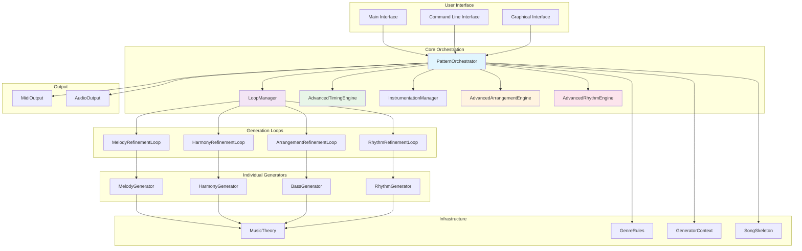

# MIDI Master Technical Specification: Advanced Generation Improvements

## Overview

This technical specification outlines the implementation of four major improvements to the MIDI generation program:

1. **Loop-based Generation Architecture**
2. **Enhanced Timing and Microtiming Algorithms**
3. **Expanded Instrumentation and Arrangement Capabilities**
4. **Improved Rhythmic Pattern Generation**

## Current Architecture Analysis

### Existing Components
- **PatternOrchestrator**: Coordinates individual generators (Melody, Harmony, Bass, Rhythm)
- **SongSkeleton**: Manages overall song structure and sections
- **Individual Generators**: Specialized classes for each pattern type
- **MidiOutput**: Converts internal representation to MIDI format
- **Genre Rules**: Genre-specific musical constraints and patterns

### Current Limitations
- Static pattern generation without iterative refinement
- Basic timing with minimal microtiming variations
- Simple instrumentation mapping (MIDI channels/programs)
- Limited rhythmic complexity and variation
- No advanced arrangement or orchestration features

## 1. Loop-Based Generation Architecture

### Overview
Implement a loop-based architecture where musical elements can be generated, evaluated, and refined through iterative cycles. This enables more sophisticated composition techniques and quality improvements.

### Key Components

#### LoopManager Class
```python
class LoopManager:
    """Manages iterative generation and refinement loops."""

    def __init__(self, max_iterations: int = 5, convergence_threshold: float = 0.1):
        self.max_iterations = max_iterations
        self.convergence_threshold = convergence_threshold
        self.generation_loops = []

    def add_generation_loop(self, loop: GenerationLoop):
        """Add a generation loop to the manager."""
        self.generation_loops.append(loop)

    def execute_all_loops(self, context: GeneratorContext) -> Pattern:
        """Execute all registered loops and return refined pattern."""
        current_pattern = None

        for loop in self.generation_loops:
            current_pattern = loop.execute(context, current_pattern)

        return current_pattern
```

#### GenerationLoop Base Class
```python
class GenerationLoop(ABC):
    """Base class for generation loops."""

    @abstractmethod
    def execute(self, context: GeneratorContext, input_pattern: Optional[Pattern]) -> Pattern:
        """Execute one iteration of the generation loop."""
        pass

    @abstractmethod
    def evaluate_quality(self, pattern: Pattern) -> float:
        """Evaluate the quality of a generated pattern."""
        pass

    @abstractmethod
    def should_continue(self, iteration: int, quality_score: float) -> bool:
        """Determine if loop should continue iterating."""
        pass
```

#### MelodyRefinementLoop
```python
class MelodyRefinementLoop(GenerationLoop):
    """Refines melody through iterative generation and evaluation."""

    def execute(self, context: GeneratorContext, input_pattern: Optional[Pattern]) -> Pattern:
        """Generate and refine melody pattern."""
        best_pattern = input_pattern
        best_score = self.evaluate_quality(input_pattern) if input_pattern else 0.0

        for iteration in range(self.max_iterations):
            # Generate new melody variation
            candidate = self.generate_melody_variation(context, best_pattern)

            # Evaluate quality
            score = self.evaluate_quality(candidate)

            # Keep if better
            if score > best_score:
                best_pattern = candidate
                best_score = score

            # Check convergence
            if not self.should_continue(iteration, score):
                break

        return best_pattern
```

### Implementation Plan

#### Phase 1: Core Loop Infrastructure
1. Create `LoopManager` class in `generators/loop_manager.py`
2. Implement base `GenerationLoop` abstract class
3. Define quality evaluation metrics (musicality, complexity, coherence)
4. Integrate loop manager into `PatternOrchestrator`

#### Phase 2: Melody Refinement Loop
1. Create `MelodyRefinementLoop` class
2. Implement contour analysis and improvement algorithms
3. Add harmonic consistency checking
4. Integrate with existing melody generator

#### Phase 3: Harmony Refinement Loop
1. Create `HarmonyRefinementLoop` class
2. Implement voice leading optimization
3. Add tension/release analysis
4. Integrate chord progression smoothing

#### Phase 4: Rhythm Refinement Loop
1. Create `RhythmRefinementLoop` class
2. Implement groove consistency analysis
3. Add rhythmic complexity optimization
4. Integrate with existing rhythm generator

## 2. Enhanced Timing and Microtiming Algorithms

### Overview
Develop sophisticated timing algorithms that go beyond basic swing to include human-like microtiming variations, tempo fluctuations, and expressive timing.

### Key Components

#### AdvancedTimingEngine Class
```python
class AdvancedTimingEngine:
    """Advanced timing and microtiming engine."""

    def __init__(self, base_tempo: float = 120.0):
        self.base_tempo = base_tempo
        self.tempo_curve = TempoCurve(base_tempo)
        self.microtiming_profiles = self._load_microtiming_profiles()

    def apply_timing_variations(self, pattern: Pattern, genre: str, mood: str) -> Pattern:
        """Apply comprehensive timing variations to a pattern."""
        # Apply tempo curve
        pattern = self.tempo_curve.apply_to_pattern(pattern)

        # Apply microtiming based on genre and mood
        microtiming_profile = self._select_microtiming_profile(genre, mood)
        pattern = self._apply_microtiming(pattern, microtiming_profile)

        # Apply expressive timing
        pattern = self._apply_expressive_timing(pattern)

        return pattern
```

#### TempoCurve Class
```python
class TempoCurve:
    """Manages tempo variations throughout a piece."""

    def __init__(self, base_tempo: float):
        self.base_tempo = base_tempo
        self.curve_points = []  # List of (beat, tempo_multiplier) tuples

    def add_acceleration(self, start_beat: float, end_beat: float, target_multiplier: float):
        """Add tempo acceleration over a range."""
        self.curve_points.append(('accelerate', start_beat, end_beat, target_multiplier))

    def add_ritardando(self, start_beat: float, end_beat: float, target_multiplier: float):
        """Add tempo slowdown over a range."""
        self.curve_points.append(('ritardando', start_beat, end_beat, target_multiplier))

    def apply_to_pattern(self, pattern: Pattern) -> Pattern:
        """Apply tempo curve to all timing in the pattern."""
        # Implementation would modify note start times and durations
        # based on tempo curve points
        pass
```

#### MicroTimingProfile Class
```python
class MicroTimingProfile:
    """Defines microtiming characteristics for different genres/moods."""

    def __init__(self, name: str):
        self.name = name
        self.timing_offsets = {}  # voice -> offset_function mapping

    def add_voice_offset(self, voice: str, offset_function: callable):
        """Add timing offset function for a specific voice."""
        self.timing_offsets[voice] = offset_function

    def apply_to_note(self, note: Note, voice: str) -> Note:
        """Apply microtiming to a note."""
        if voice in self.timing_offsets:
            offset = self.timing_offsets[voice](note.start_time, note.velocity)
            note.start_time += offset
        return note
```

### Implementation Plan

#### Phase 1: Core Timing Infrastructure
1. Create `AdvancedTimingEngine` class in `generators/timing_engine.py`
2. Implement `TempoCurve` class for dynamic tempo variations
3. Define microtiming profile system
4. Integrate with existing MIDI output system

#### Phase 2: Genre-Specific Microtiming
1. Create microtiming profiles for different genres:
   - Jazz: Complex swing with variable intensity
   - Funk: Tight but groovy timing
   - Rock: Aggressive timing with fills
   - Classical: Precise timing with minimal variation
2. Implement voice-specific timing offsets
3. Add mood-based timing adjustments

#### Phase 3: Expressive Timing Features
1. Implement breath and phrasing timing
2. Add performance anxiety simulation (slight rushing in high-pressure sections)
3. Create ensemble timing coordination
4. Add tempo rubato for expressive sections

## 3. Expanded Instrumentation and Arrangement Capabilities

### Overview
Enhance the system to support sophisticated instrumentation choices and advanced arrangement techniques beyond simple MIDI channel mapping.

### Key Components

#### InstrumentationManager Class
```python
class InstrumentationManager:
    """Manages instrument selection and configuration."""

    def __init__(self):
        self.instrument_library = self._load_instrument_library()
        self.arrangement_rules = self._load_arrangement_rules()

    def select_instruments_for_genre(self, genre: str, mood: str, complexity: str) -> Dict[str, Instrument]:
        """Select appropriate instruments for genre, mood, and complexity."""
        # Implementation would analyze genre requirements and select instruments
        pass

    def configure_arrangement(self, instruments: Dict[str, Instrument], arrangement_type: str) -> Arrangement:
        """Configure how instruments are arranged in the mix."""
        # Implementation would set up spatial positioning, balance, etc.
        pass
```

#### AdvancedArrangementEngine Class
```python
class AdvancedArrangementEngine:
    """Handles complex arrangement techniques."""

    def __init__(self):
        self.arrangement_techniques = self._load_techniques()

    def apply_arrangement_technique(self, pattern: Pattern, technique: str) -> Pattern:
        """Apply a specific arrangement technique to a pattern."""
        if technique == 'counterpoint':
            return self._apply_counterpoint(pattern)
        elif technique == 'call_response':
            return self._apply_call_response(pattern)
        elif technique == 'layering':
            return self._apply_layering(pattern)
        elif technique == 'orchestration':
            return self._apply_orchestration(pattern)

    def _apply_counterpoint(self, pattern: Pattern) -> Pattern:
        """Apply counterpoint arrangement technique."""
        # Implementation would create melodic lines that complement each other
        pass

    def _apply_call_response(self, pattern: Pattern) -> Pattern:
        """Apply call and response arrangement technique."""
        # Implementation would create alternating musical phrases
        pass
```

### Implementation Plan

#### Phase 1: Enhanced Instrument Library
1. Create comprehensive instrument database with characteristics:
   - Timbre properties (bright, warm, harsh, mellow)
   - Register ranges (low, mid, high)
   - Articulation capabilities (sustained, staccato, legato)
   - Genre associations
2. Implement instrument selection algorithms based on musical context
3. Add instrument compatibility checking

#### Phase 2: Advanced Arrangement Techniques
1. Implement counterpoint generation algorithms
2. Create call-and-response pattern generation
3. Add layering and orchestration techniques
4. Develop arrangement templates for different genres

#### Phase 3: Spatial and Dynamic Control
1. Implement stereo positioning and panning
2. Add dynamic range control per instrument
3. Create reverb and effects routing
4. Add instrument doubling and divisi capabilities

## 4. Improved Rhythmic Pattern Generation

### Overview
Develop sophisticated rhythmic pattern generation that goes beyond simple templates to include complex polyrhythms, syncopation, and genre-authentic groove patterns.

### Key Components

#### AdvancedRhythmEngine Class
```python
class AdvancedRhythmEngine:
    """Advanced rhythm pattern generation engine."""

    def __init__(self):
        self.rhythm_patterns = self._load_rhythm_patterns()
        self.polyrhythm_engine = PolyrhythmEngine()
        self.syncopation_engine = SyncopationEngine()

    def generate_complex_rhythm(self, genre: str, complexity: str, time_signature: str) -> RhythmPattern:
        """Generate complex rhythmic patterns."""
        base_pattern = self._select_base_pattern(genre, complexity)

        # Apply polyrhythms
        if complexity in ['complex', 'dense']:
            base_pattern = self.polyrhythm_engine.apply_polyrhythm(base_pattern)

        # Apply syncopation
        if genre in ['jazz', 'funk', 'latin']:
            base_pattern = self.syncopation_engine.apply_syncopation(base_pattern)

        # Apply groove variations
        base_pattern = self._apply_groove_variations(base_pattern, genre)

        return base_pattern
```

#### PolyrhythmEngine Class
```python
class PolyrhythmEngine:
    """Handles polyrhythmic pattern generation."""

    def apply_polyrhythm(self, pattern: RhythmPattern) -> RhythmPattern:
        """Apply polyrhythmic elements to a pattern."""
        # Implementation would create overlapping rhythmic layers
        # with different subdivisions (e.g., 3 over 4, 5 over 8)
        pass

    def generate_cross_rhythm(self, primary_pulse: int, secondary_pulse: int) -> RhythmPattern:
        """Generate cross-rhythmic patterns."""
        # Implementation would create rhythmic conflicts and resolutions
        pass
```

#### SyncopationEngine Class
```python
class SyncopationEngine:
    """Handles syncopation and groove generation."""

    def apply_syncopation(self, pattern: RhythmPattern) -> SyncopationLevel:
        """Apply syncopation to a rhythm pattern."""
        # Implementation would strategically place off-beat accents
        # and create groove-specific timing variations
        pass

    def generate_swing_feel(self, pattern: RhythmPattern, swing_intensity: float) -> RhythmPattern:
        """Generate swing feel with variable intensity."""
        # Implementation would apply swing timing to off-beats
        # with controllable intensity
        pass
```

### Implementation Plan

#### Phase 1: Enhanced Rhythm Pattern Library
1. Expand rhythm pattern database with more complex templates
2. Add genre-specific groove patterns and variations
3. Implement pattern transformation algorithms
4. Create rhythm complexity metrics

#### Phase 2: Polyrhythm and Cross-Rhythm Support
1. Implement polyrhythm generation algorithms
2. Add cross-rhythm pattern creation
3. Create rhythmic tension and resolution systems
4. Integrate with existing rhythm generator

#### Phase 3: Advanced Syncopation and Groove
1. Implement sophisticated syncopation algorithms
2. Add groove-specific timing variations
3. Create feel and swing intensity controls
4. Develop rhythm blending and morphing capabilities

## System Architecture Diagram



## Implementation Timeline

### Month 1: Core Infrastructure
- Implement LoopManager and base GenerationLoop classes
- Create AdvancedTimingEngine foundation
- Design InstrumentationManager structure
- Set up AdvancedRhythmEngine base

### Month 2: Generation Loops
- Complete MelodyRefinementLoop
- Implement HarmonyRefinementLoop
- Build RhythmRefinementLoop
- Create ArrangementRefinementLoop

### Month 3: Enhanced Timing
- Implement TempoCurve system
- Build microtiming profiles
- Add expressive timing features
- Integrate with MIDI output

### Month 4: Advanced Features
- Complete instrumentation system
- Implement arrangement techniques
- Build polyrhythm and syncopation engines
- Add spatial and dynamic controls

### Month 5: Integration and Testing
- Integrate all components
- Comprehensive testing
- Performance optimization
- Documentation completion

## Quality Metrics and Evaluation

### Musical Quality Metrics
- **Melodic Coherence**: Contour smoothness and harmonic consistency
- **Rhythmic Groove**: Timing accuracy and feel authenticity
- **Harmonic Richness**: Chord voicing quality and voice leading
- **Arrangement Balance**: Instrumental balance and spatial distribution
- **Overall Musicality**: Subjective quality assessment

### Technical Performance Metrics
- **Generation Speed**: Time to generate complex patterns
- **Memory Usage**: RAM consumption during generation
- **MIDI File Size**: Efficiency of output format
- **Real-time Capability**: Ability to generate in real-time

### Evaluation Framework
```python
class QualityEvaluator:
    """Evaluates generated music quality."""

    def evaluate_pattern(self, pattern: Pattern) -> Dict[str, float]:
        """Evaluate a pattern across multiple quality dimensions."""
        return {
            'melodic_quality': self._evaluate_melodic_quality(pattern),
            'rhythmic_quality': self._evaluate_rhythmic_quality(pattern),
            'harmonic_quality': self._evaluate_harmonic_quality(pattern),
            'arrangement_quality': self._evaluate_arrangement_quality(pattern),
            'overall_quality': self._calculate_overall_quality(pattern)
        }
```

## Conclusion

This technical specification provides a comprehensive roadmap for significantly enhancing the MIDI generation program's capabilities. The proposed improvements will transform it from a basic pattern generator into a sophisticated music composition system capable of creating professional-quality MIDI content with advanced timing, instrumentation, and arrangement features.

The modular architecture ensures that each improvement can be implemented incrementally while maintaining backward compatibility with the existing system. The loop-based generation approach provides a foundation for continuous quality improvement through iterative refinement.